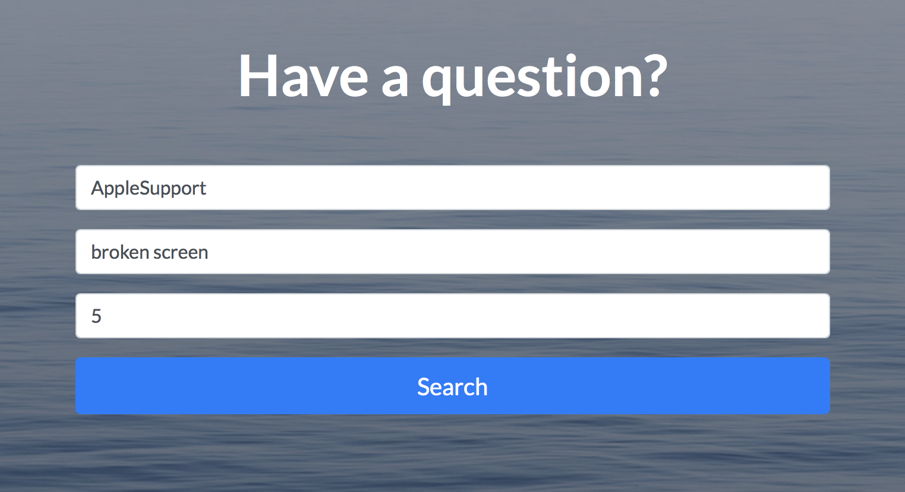

# Twitter Customer Support
As part of a Convergent Build Team, we were tasked with finding a way to monetize Twitter. We realized that many companies used customer support handles in order to quickly and efficiently respond to customers' problems. We decided to leverage this system to create a Twitter Customer Service platform that allows users to search for previously answered questions.

## Backend - Twitter API and Natural Language Processing
This project uses the python-twitter API found [here](https://github.com/bear/python-twitter) to retrieve tweets from a user's timeline and search them. To determine relevance to the user's query, a [natural language processing library](http://www.nltk.org/book/) is used to filter out stopwords, then the number of matching words from the user's query is calculated. In addition, the number of favorites and retweets is also used to determine relevance.

## Frontend - Django and Bootstrap 
The HTML and CSS pages for this project were created with Bootstrap, though each uses Django to automatically generate forms and content. The tweet results are displayed by using Django to autogenerate JavaScript code which uses [Twitter's API](https://dev.twitter.com/web/embedded-tweets).

## Future Plans
In the future, I'd like to:
* Automatically hash a companies tweets and store them for fast retreival
* Add a "Like" feature that allows people to indicate what tweets are helpful

## Some Images

